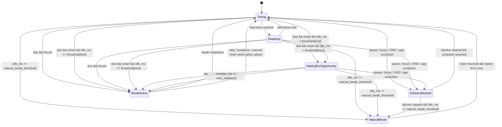

# Reminder Scheduling

## 文档目的
- 这份文档描述当前 desktop host 实际采用的提醒调度模型。
- 目标是让状态机回到最小可解释集合，优先保证“不要在输入过程中硬打断”，而不是继续堆叠恢复补偿逻辑。

## 一句话原则
- 到点，不等于立刻打断。
- `Smart` 只做一件事：到点后先等一个明确空档；如果一直等不到，就在最长等待后开始。
- `Forced` 只做一件事：到点直接开始 break。
- `Natural breaks` 只负责“长时间离开后整轮重排”，不是第三种提醒方式。
- `pause / focus / DND / app exclusion` 只冻结投递，不重置节奏。

## 基础信号

### `idle_ms`
- 调度只依赖一个输入信号：距离最近一次键盘或鼠标输入过去了多久。
- 当前模型不尝试推断“是否深度专注”或“是否真的适合被打断”，只用 `idle_ms` 做最小决策。

### `due_at`
- 节奏层负责算出下一次 pending break 的 `kind` 与 `due_at`。
- 调度层只决定“这个已经到点的 break 现在是否开始”。

## 两种提醒方式

### `Smart`
- `due_at` 之前绝不开始 break。
- 到点后：
  - 如果 `idle_ms >= threshold(kind)`，立即开始。
  - 否则如果 `overdue_ms >= max_wait(kind)`，立即开始。
  - 否则进入 `WaitingForOpportunity`。

### `Forced`
- `due_at` 之前绝不开始 break。
- 到点后直接开始 break。
- 一旦开始，按严格打断语义处理，不允许把智能等待逻辑混进来。

## 固定阈值

### 微休息
- `idle_threshold = 8s`
- `max_wait = 90s`

### 长休息
- `idle_threshold = 12s`
- `max_wait = 180s`

### 自然休息
- 使用 `natural_break_threshold` 判断是否算作长时间离开。
- 默认值仍由设置决定，当前默认是 `5min`。

## 状态列表
- `Timing`
  正常计时，尚未到达本轮 break 的 `due_at`。
- `HeadsUp`
  break 尚未到点，但已经进入 due 前提醒窗口。
- `WaitingForOpportunity`
  break 已到点、当前是 `Smart`，但 `idle_ms` 还没达到固定阈值，且也还没等满 `max_wait`。
- `DeliveryBlocked`
  当前被 `pause / focus / DND / app exclusion` 阻塞，pending break 保留但不投递。
- `NaturalBreak`
  用户已离开足够久，本轮视为自然休息，等待回到电脑后从当前时间重新排下一轮。
- `BreakActive`
  break 已开始，交给现有 break lifecycle 继续运行。

## 状态图


## Tick 优先级
每次后台 tick 按下面顺序判定，避免状态竞争。

```mermaid
flowchart TD
    A[tick(now)] --> B{当前 break 是否已开始?}
    B -- yes --> B1[维护 BreakActive 生命周期]
    B -- no --> C{刚从 NaturalBreak 返回?}
    C -- yes --> C1[reset schedule from now]
    C -- no --> D
    C1 --> D{是否存在 delivery blocker?}
    D -- yes --> D1[进入 DeliveryBlocked\n冻结 due / notification / wait timer]
    D -- no --> E{是否命中自然休息?}
    E -- yes --> E1[进入 NaturalBreak]
    E -- no --> F{now >= due_at ?}
    F -- no --> F1[保持 Timing / HeadsUp]
    F -- yes --> G{提醒方式}
    G -- Forced --> H[立即开始 BreakActive]
    G -- Smart --> I{idle_ms >= threshold(kind)?}
    I -- yes --> H
    I -- no --> J{overdue_ms >= max_wait(kind)?}
    J -- yes --> H
    J -- no --> K[进入 WaitingForOpportunity]
```

优先级结论：

1. `BreakActive` 生命周期优先。
2. `DeliveryBlocked` 只冻结投递，不关闭 active break，也不整轮 reset。
3. `NaturalBreak` 只在“离开足够久”时成立，并在用户恢复输入后从当前时间重排。
4. `Smart` 不再做恢复结算、积分抵扣或阈值递减。

## 调度伪代码
```text
tick(now):
  if current_break.exists():
    drive_active_break()
    return

  if just_returned_from_natural_break():
    reset_schedule(now)

  if delivery_blocker_active():
    state = DeliveryBlocked
    return

  if natural_breaks_enabled and idle_ms >= natural_break_threshold:
    state = NaturalBreak
    return

  if now < due_at:
    state = Timing / HeadsUp
    return

  if reminder_mode == Forced:
    start_break()
    return

  if idle_ms >= idle_threshold(kind):
    start_break()
    return

  if now - due_at >= max_wait(kind):
    start_break()
    return

  state = WaitingForOpportunity
```

## Blocker 语义

### passive blockers
- `pause`
- `focus`
- `DND`
- `app exclusion`

这些 blocker 的语义是：
- 暂停投递
- 平移 `due_at`
- 平移 heads-up 通知时间
- 平移 `WaitingForOpportunity` 的计时起点

它们不做：
- 不关闭已经开始的 break
- 不把整轮节奏重新从现在开始

## Heads-up 语义
- `HeadsUp` 只是 due 前的可见 cue，不是 break 已开始。
- 可以通过设置页运行态、tray 文本和系统通知表现出来。
- heads-up 提前多久，仍由各 break 的 notification lead time 决定。

## 设置层建议

### 对用户暴露
- `Reminder mode`
  - `Smart`
  - `Forced`
- `Natural breaks`
  - 开关 + reset threshold

### 暂不暴露
- `idle_threshold`
- `max_wait`

这两个值先作为内置常量，优先验证体验是否足够稳定。

## 当前设计边界
- 这不是“真正理解专注状态”的模型，只是“到点后别立刻硬弹”的最小方案。
- 如果之后还要继续演进，下一步应该从更可靠的 `interruptibility` 信号入手，而不是重新引入更多补偿状态。
