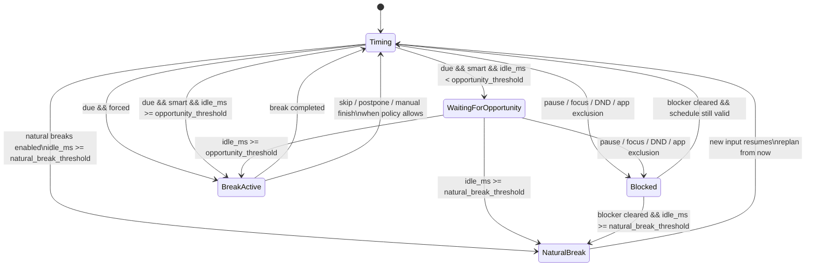

# Reminder Scheduling

## 文档目的
- 这份文档定义下一轮要收敛的提醒状态机与调度逻辑。
- 目标是先做减法，优先解决“不要在用户正在操作电脑时被固定时间硬打断”。
- 本文描述的是目标模型，不等同于当前已经落地的全部实验性 adaptive 细节。

## 一句话原则
- 到点，不等于立刻打断。
- 智能提醒只判断“用户最近有没有输入活动”，不做更复杂的专注推理。
- 强制提醒就是严格的定时打断模式。
- 自然休息是长时间离开后的重置规则，不是第三种提醒方式。
- `breakPromptStyle` 不应进入调度决策；它如果保留，也只能是 UI 表现层。

## 核心概念

### 1. 用户是否正在操作电脑
系统只使用一个基础信号：

- `idle_ms`：距离最近一次键盘或鼠标输入已经过去了多久。

基于这个信号，只区分两个状态：

- `active`：用户最近仍在持续操作电脑。
- `idle`：用户已经停下来一小会儿，出现了可打断空档。

这里不尝试判断：

- 用户是否真的在思考
- 用户是否正在看另一块屏幕
- 用户是否真的站起来活动

第一版只解决“输入过程中不要被硬打断”。

### 2. 提醒方式

#### 智能提醒
- 超过久坐时间后，如果用户还在操作电脑，先不打断。
- 等到出现一个短空档后，再开始 break。

#### 强制提醒
- 超过久坐时间后，立即开始 break。
- 不看当前是否还在操作电脑。
- 它同时代表“严格打断”。
- 也就是：一旦开始，不再单独提供一个额外的“严格模式”概念给用户。

### 3. 自然休息
- 自然休息也不是提醒方式。
- 它表示：如果用户已经长时间没有键盘/鼠标输入，就把这段离开算作一次已完成的休息。
- 这时不再补发刚才那次提醒，而是在用户回来后重新开始计时。

## 推荐的调度分层

### 节奏层
- 负责算出下一次 break 的 `kind` 和 `due_at`。
- 微休息、长休息的节奏仍由现有 break planner 决定。

### 活动探测层
- 负责持续提供 `idle_ms`。
- 这个信号必须独立存在，不能再绑在 `natural_breaks` 开关上。

### 投递层
- 负责决定“已经到点的 break 现在要不要开始”。
- 这里只看：
  - `reminder_mode`
  - `idle_ms`
  - blocker 状态
  - natural break 状态

### 执行层
- break 一旦开始，交给现有 break lifecycle 处理。
- 若当前是 `强制提醒`，则按严格打断语义处理，不再额外引入单独的 `strict_mode` 用户概念。

## 目标状态机

### 状态列表
- `Timing`
  正常计时，尚未到达本轮 break 的触发时间。
- `WaitingForOpportunity`
  已经过了 `due_at`，但当前是智能提醒且用户仍在操作电脑，所以暂缓打断。
- `BreakActive`
  break 已经正式开始，窗口/通知已进入当前 break 生命周期。
- `Blocked`
  当前被 pause、focus session、DND、app exclusion 等规则阻塞，不应投递 break。
- `NaturalBreak`
  用户已经离开电脑够久，本轮视为已完成自然休息，等待用户回来后重新开始计时。

### 状态图


## Tick 调度优先级
每次后台 tick 都按同一顺序判定，避免状态竞争。

```mermaid
flowchart TD
    A[tick(now)] --> B{当前 break 是否已开始?}
    B -- yes --> B1[维护 break 生命周期]
    B -- no --> C{是否存在 blocker?}
    C -- yes --> C1[进入 Blocked\n不投递 break]
    C -- no --> D{是否命中自然休息?}
    D -- yes --> D1[取消 pending due\n标记 NaturalBreak]
    D -- no --> E{now >= due_at ?}
    E -- no --> E1[保持 Timing]
    E -- yes --> F{提醒方式}
    F -- 强制提醒 --> G[立即开始 BreakActive]
    F -- 智能提醒 --> H{idle_ms >= opportunity_threshold ?}
    H -- yes --> G
    H -- no --> I[进入 WaitingForOpportunity]
```

优先级结论：

1. `BreakActive` 生命周期优先。
2. blocker 优先于提醒投递。
3. 自然休息优先于“已经到点但还没开始”的 pending break。
4. 智能提醒只在“已到点且当前仍 active”时进入 `WaitingForOpportunity`。

## 建议的调度伪代码
```text
tick(now):
  if current_break.exists():
    drive_active_break()
    return

  if blocker_active():
    state = Blocked
    return

  if natural_breaks_enabled and idle_ms >= natural_break_threshold:
    clear_pending_due()
    state = NaturalBreak
    return

  if now < due_at:
    state = Timing
    return

  if reminder_mode == Forced:
    start_break()
    return

  if idle_ms >= opportunity_threshold:
    start_break()
    return

  state = WaitingForOpportunity
```

当处于 `NaturalBreak` 时：

```text
if user_input_resumed():
  replan_from_now()
  state = Timing
```

## 推荐阈值
为了先做减法，第一版建议只保留两类阈值：

- `opportunity_threshold`
  - 推荐默认值：`12s`
  - 用途：判断用户是不是刚刚停下来，可以接受提醒。
- `natural_break_threshold`
  - 推荐默认值：`5min`
  - 用途：判断这段离开是否应该直接算作一次已完成休息。

第一版建议：

- 不区分 microbreak / long break 的不同机会阈值。
- 不引入 soft nudge。
- 不新增“连续等待多久再轻提醒一次”的第二层策略。

如果以后需要更细化，再在这个最小模型之上追加，而不是一开始就把状态机做复杂。

## 设置层建议

### 对用户暴露的设置
- `提醒方式`
  - `智能提醒`
  - `强制提醒`
- `自然休息`
  - 保留开关语义

### 暂不暴露的设置
- `opportunity_threshold`
- `natural_break_threshold`

第一版先固定默认值，先验证体验，不急着把所有阈值做进设置页。

## 运行时数据建议
如果要把这版模型落到 host，可把运行时真源收敛为：

- `next_due_kind`
- `next_due_at_ms`
- `delivery_state`
  - `timing | waiting_for_opportunity | blocked | natural_break | break_active`
- `idle_ms`
- `blocker_reason`
- `current_break`

关键点：

- `delivery_state` 负责“何时提醒”。
- `current_break` 负责“提醒开始后发生什么”。
- 两者不要再混在一个隐式分支里。

## 两种提醒方式的用户语义

### 智能提醒
- 到点后先等空档。
- 目标是尽量少打断用户正在进行中的输入和操作。

### 强制提醒
- 到点直接开始 break。
- 它本身就意味着严格打断，不再单独叠加一个“严格模式”设置。

## 自然休息的明确语义
自然休息的判断只表示：

- “用户已经长时间没有任何输入活动”

它不表示：

- “已经确认用户站起来了”
- “已经确认用户做了拉伸”
- “已经确认用户休息质量合格”

所以这项能力的产品含义必须写清楚：

- 如果你已经离开电脑一段时间，我会把这段时间算作一次休息，并重新开始计时。

## 典型场景

### 场景 1：智能提醒，用户正在连续输入
1. 微休息到点。
2. `idle_ms = 2s`，说明用户仍在持续操作。
3. 系统进入 `WaitingForOpportunity`，不立刻弹窗。
4. 用户停下来喝口水，`idle_ms = 14s`。
5. 系统开始 break。

### 场景 2：强制提醒，用户正在连续输入
1. 微休息到点。
2. 即使 `idle_ms = 2s`，也直接开始 break。

### 场景 3：用户离开电脑一段时间
1. break 即将到点或已经到点。
2. 用户离开座位，`idle_ms` 持续增长。
3. 当 `idle_ms >= natural_break_threshold`，系统进入 `NaturalBreak`。
4. 本轮 break 不再补发。
5. 用户回来重新输入后，从当前时间重新开始计时。

### 场景 4：强制提醒
1. 到点直接开始 break。
2. 不等待空档。
3. 因为它本身就是严格打断，所以不再单独区分“强制提醒 + 严格模式”。

## 当前实现需要调整的点
- `idle_ms` 的采样必须从 `natural_breaks` 开关中解耦。
- `breakPromptStyle` 不得继续参与提醒策略讨论。
- `soft nudge` 应从第一版核心状态机里移除。
- `strict_mode` 不应再作为独立用户设置与 `强制提醒` 并列存在。
- 提醒投递逻辑要收敛为统一的 `delivery_state`，不要散落在多个隐式字段里。

## 不在本轮解决的问题
- 不做更复杂的“专注度识别”。
- 不做全局键盘语义识别或内容级输入判断。
- 不做 standing / motion / camera 等额外传感器判断。
- 不在第一版加入多档智能策略或 per-break-kind 专属阈值。

## 推荐的用户文案
- `智能提醒`
  超过久坐时间后，如果你还在操作电脑，我会等你停下来再提醒。
- `强制提醒`
  超过久坐时间后，我会立即提醒你休息。
- `自然休息`
  如果你已经离开电脑一段时间，我会把这段时间算作一次休息，并重新开始计时。
